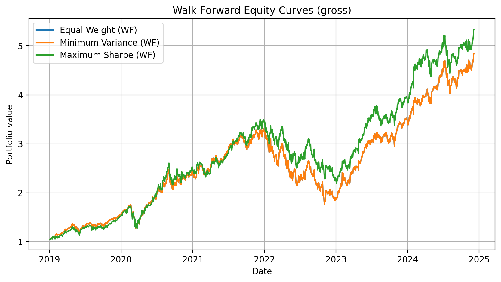

# portfolio-optimization-methods

Portfolio allocation is easy to optimize **in-sample** and much harder to validate **out-of-sample**.
This project benchmarks classic portfolio optimization methods against a simple Equal-Weight portfolio,
under realistic constraints and a walk-forward (rolling) evaluation framework.

> Note: results in the notebook are reported in **gross returns** (no transaction costs deducted).
> The framework is designed so that transaction-cost models (net returns) can be added as an extension.

## Notebook (HTML)

The full analysis notebook is available as an interactive HTML page:

**[Open the walk-forward notebook](https://Morales-Mathieu.github.io/portfolio-optimization-methods/01_portfolio_optimization_walkforward.html)**

---

## Objective

**Do portfolio optimization methods (e.g. Minimum Variance, Maximum Sharpe) deliver better risk-adjusted performance than a naive Equal-Weight portfolio once we evaluate them strictly out-of-sample?**

To answer this, the project:
- compares multiple allocation methods (Equal-Weight, Minimum Variance, Maximum Sharpe),
- enforces realistic constraints (long-only, fully invested, weight caps),
- evaluates performance with risk and downside metrics (Sharpe, max drawdown, Sortino, Calmar, VaR),
- uses **walk-forward backtesting** (rolling train/test) to reduce look-ahead bias.

---

## Methods implemented

### 1) Equal-Weight (benchmark)
A robust baseline: identical weights across assets (e.g. 20% each in a 5-asset universe).

### 2) Minimum Variance
Finds weights that minimize portfolio variance under constraints (risk-focused).

### 3) Maximum Sharpe
Optimizes the expected return / risk trade-off (return-driven, typically more sensitive to estimation error).

---

## Walk-forward backtesting (out-of-sample)

We simulate a realistic investment process:
- **Training window:** 252 trading days (~1 year)
- **Test window:** 21 trading days (~1 month)
- **Rebalancing:** monthly (weights are re-estimated each cycle, then applied out-of-sample)

---

## Results (snapshot)

### Walk-forward equity curves (gross)
Comparison of the three strategies evaluated strictly out-of-sample:

**Key takeaway (in this dataset):**
- Maximum Sharpe tends to achieve slightly better risk-adjusted performance and smaller drawdowns,
- Minimum Variance often ends up close to Equal-Weight (especially when assets are highly correlated and capped),
- the performance gap shrinks out-of-sample compared to in-sample results → highlighting estimation error risk.

---

## Benchmark & risk decomposition

To understand *where* performance comes from, strategies are also compared to a market benchmark (S&P 500 proxy),
with CAPM-style metrics (Alpha, Beta) and additional downside measures (Sortino, Calmar) + historical VaR.

---

## How to run

1. Create and activate a virtual environment
2. Install requirements
3. Run the main notebook

Main notebook:
- `notebooks/01_portfolio_optimization_walkforward.ipynb`

---

## Repository structure

- `notebooks/` : step-by-step analysis and experiments  
- `src/` : reusable portfolio + backtesting functions (if/when refactored from notebook)  
- `data/` : raw and processed market data  
- `reports/figures/` : exported figures used in the README  

---

## Extensions (ideas)
- Add transaction costs (net returns) using turnover-based cost model
- Test multiple asset universes (equities vs diversified ETFs)
- Add other allocation methods (risk parity, ERC, volatility targeting)
- Robust optimization / shrinkage covariance estimators
