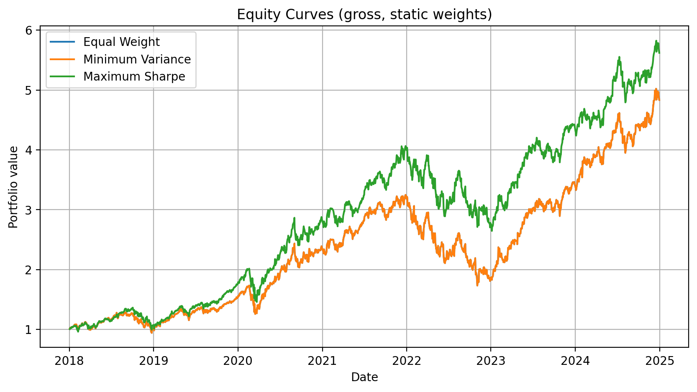

# portfolio-optimization-methods

This project investigates whether portfolio optimization techniques can
consistently outperform a naive Equal-Weight portfolio once realistic
constraints and out-of-sample evaluation are taken into account.

## Objective

The central question addressed by this project is:

**Can portfolio optimization methods (such as Minimum Variance or Maximum Sharpe)
deliver superior risk-adjusted performance compared to a simple Equal-Weight
benchmark when evaluated under realistic conditions?**

To answer this question, the project:
- compares multiple portfolio allocation strategies,
- enforces realistic constraints (long-only, weight caps),
- evaluates performance using risk-adjusted metrics,
- extends the analysis to walk-forward backtesting and transaction costs.

## Benchmark: Equal-Weight Portfolio

The Equal-Weight portfolio serves as a naive but robust benchmark throughout the
analysis. It allocates identical weights to each asset in the investment universe
(e.g. 20% per asset for a 5-asset portfolio).

This benchmark is intentionally simple:
- static allocation,
- no optimization,
- no rebalancing,
- no transaction costs.

It provides a transparent reference point against which more sophisticated
allocation methods can be evaluated.

## Results (snapshot)

The figure below compares the performance of three **static** portfolio
allocation strategies over the full sample period:

- **Equal-Weight** (naive benchmark),
- **Minimum Variance** (risk-focused optimization),
- **Maximum Sharpe Ratio** (return-driven optimization).

The Maximum Sharpe portfolio exhibits higher in-sample risk-adjusted performance,
while the Equal-Weight and Minimum Variance strategies deliver similar outcomes in
this asset universe. Since these results rely on full-sample estimates, they may
be affected by estimation error.

This motivates the use of walk-forward backtesting and transaction costs in the
next stage of the analysis.

## Methodology & Details

All data processing, portfolio construction, optimization procedures, and
performance analyses are documented step by step in the main notebook:

- `notebooks/01_portfolio_optimization_walkforward.ipynb`

## Repository Structure

- `notebooks/` : documented analysis and experiments  
- `src/` : reusable portfolio and backtesting functions  
- `data/` : raw and processed market data  
- `reports/figures/` : exported figures used in the README  
